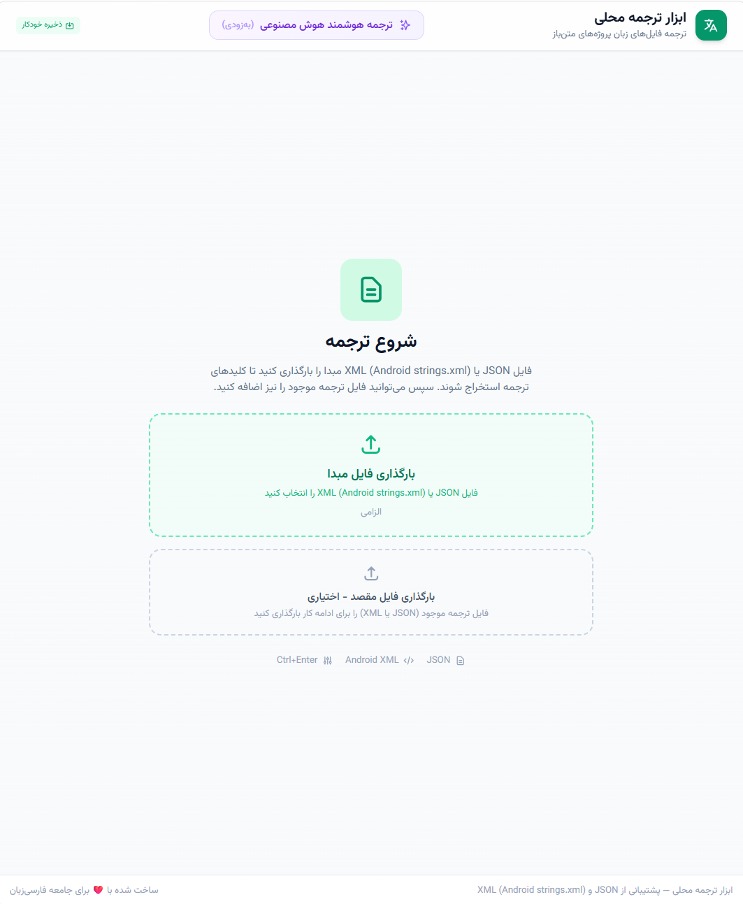

# 🌐 ابزار ترجمه محلی | Local Translation Tool

یک ابزار کلاینت‌ساید (Client-side)، سریع و بدون وابستگی (Zero-Dependency) برای بومی‌سازی و ترجمه رشته‌به‌رشته فایل‌های پروژه شامل فرمت‌های **Android XML** و **JSON**. این برنامه به مترجمان اجازه می‌دهد تا فایل‌های زبان برنامه‌ها را بدون به‌هم‌ریختن ساختار، به‌صورت محلی ترجمه و مدیریت کنند.

A lightweight, zero-dependency, client-side tool designed for string-by-string localization of **Android XML** and **JSON** files. It enables translators to easily manage project language assets locally without breaking nested or strict file structures.

🔗 **نسخه آنلاین:** [https://mcuteangel.github.io/local_translation/](https://mcuteangel.github.io/local_translation/)



---

## ✨ ویژگی‌های کلیدی | Key Features

* **🗂️ پشتیبانی از فرمت‌های استاندارد:** پارس و سه‌رشته‌سازی هوشمند فایل‌های `strings.xml` اندروید و فایل‌های تو در توی `JSON`.
* **🔒 حریم خصوصی کامل (Local-First):** بدون نیاز به سرور یا پایگاه داده؛ تمام پردازش‌ها در مرورگر شما انجام شده و داده‌ها در `LocalStorage` ذخیره می‌شوند.
* **🛡️ خروجی هوشمند و Fallback استاندارد:**
  * کلیدهای ترجمه‌نشده در زمان خروجی حذف می‌شوند تا در اندروید یا وب، به‌طور خودکار مکانیزم Fallback (سوئیچ روی زبان اصلی) فعال بماند.
  * جلوگیری از کپی شدن اشتباه متون مبدا در مقصد جهت حفظ صحت فیلترها در بارگذاری‌های بعدی.
* **🔍 فیلترینگ و جستجوی پیشرفته:** امکان فیلتر کردن رشته‌ها بر اساس وضعیت‌های «همه»، «ترجمه‌شده» و «ترجمه‌نشده (Missing)».
* **⚡ تجربه کاربری بهینه (UX):**
  * پشتیبانی از دکمه‌های درج سریع متغیرها و کاراکترهای خاص (مانند `%s`، `%d`، `{0}` و غیره).
  * کلید میانبر `Ctrl + Enter` برای ذخیره و پرش خودکار به اولین فیلد خالی بعدی.
  * سیستم صفحه‌بندی (Pagination) منعطف برای کارایی بالا در فایل‌های سنگین.

---

## 🛠️ تکنولوژی‌های به‌کار رفته | Tech Stack

* **HTML5** (Semantic structure)
* **Tailwind CSS** (Responsive & Modern UI)
* **Vanilla JavaScript (ES6+)** (No frameworks, pure performance)

---

## 🚀 نحوه استفاده | How to Use

### ۱. بارگذاری فایل مبدا (Source)
فایل زبان اصلی پروژه خود را (مثلاً فایل انگلیسی `strings.xml` یا `en.json`) وارد کنید. برنامه کلیدها را استخراج کرده و ساختار درختی را به فرمت فلت تبدیل می‌کند.

### ۲. بارگذاری فایل مقصد (Target - اختیاری)
اگر قبلاً بخشی از فایل را ترجمه کرده‌اید، می‌توانید فایل نیمه‌کاره مقصد را (مثلاً `fa.xml` یا `fa.json`) بارگذاری کنید تا ترجمه‌های قبلی شما در فیلدها جایگذاری شوند.

### ۳. ترجمه و ناوبری سریع
شروع به ترجمه رشته‌ها کنید. پس از اتمام هر رشته، فشردن کلید **`Ctrl + Enter`** به طور خودکار موقعیت شما را به رشتهٔ ترجمه‌نشده بعدی منتقل می‌کند.

### ۴. خروجی گرفتن (Export)
پس از اتمام کار، فرمت مورد نظر خود را انتخاب کرده و خروجی بگیرید. فایل نهایی به طور تمیز سه‌رشته‌سازی (Serialize) یا Unflatten شده و ساختار اصلی (شامل آرایه‌ها در XML و ساختارهای درختی در JSON) را بازسازی می‌کند.

---

## 📦 راه‌اندازی پروژه | Installation

این پروژه کاملاً **Single-page Static Web App** است. برای اجرا کافیست مخزن را کلون کرده و فایل `index.html` را در مرورگر باز کنید:

```bash
# کلون کردن مخزن
git clone https://github.com/mcuteangel/local_translation.git

# ورود به پوشه پروژه
cd local_translation

# اجرا (فقط باز کردن فایل در مرورگر)
open index.html

```

---

## 📝 لایسنس | License

این پروژه تحت لایسنس [MIT](https://www.google.com/search?q=LICENSE) منتشر شده است. استفاده و توسعه آن برای اهداف شخصی و تجاری کاملاً آزاد است.
